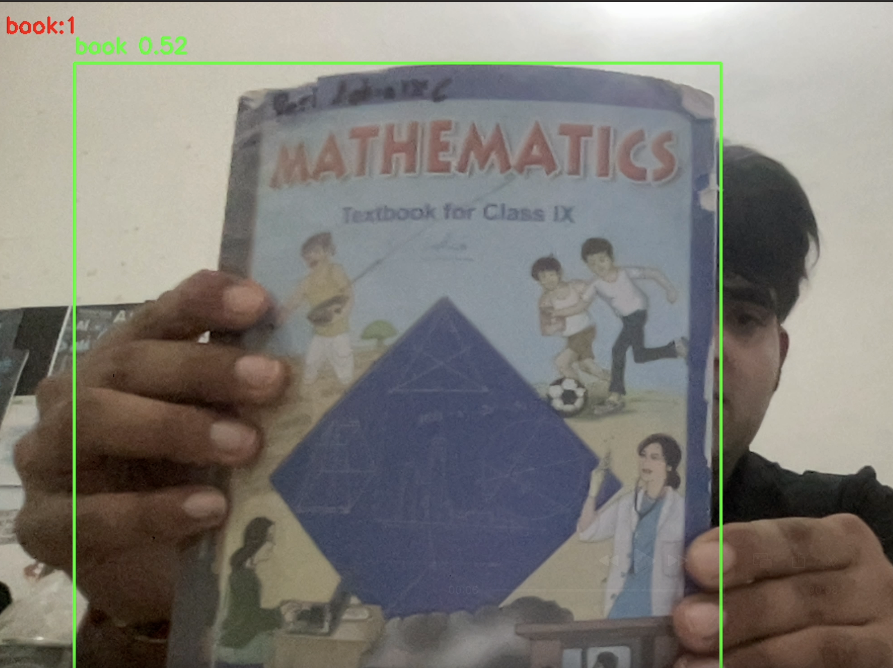

### 🧠 Object Detection Mini-System using YOLOv8 + OpenCV
This project is a real-time object detection mini-system built using the YOLOv8 model, OpenCV, and a simple SQLite database.

It detects common objects (like bottles, laptops, phones, etc.) using your webcam and logs every detection in a database.

### 🚀 Features

-> 🎯 Detects objects in real-time using webcam

-> 🧾 Logs each detection event into a local database

-> 🧍 Counts and displays the number of detected objects per frame

-> ⚙️ Uses Ultralytics YOLOv8 model for accurate detection

-> 🧩 Simple, extendable, and beginner-friendly Python implementation

### stack used

-> Python 3.8+

-> OpenCV

-> Ultralytics YOLOv8

-> SQLite3 (for database)

-> Collections (for object counting)

